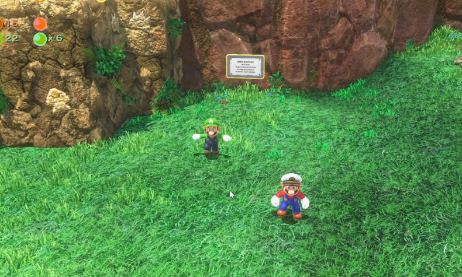

# Odyssey Local Co-op

Odyssey Local Co-op adds a second full player actor to **Super Mario Odyssey 1.0.0** so two people can play together on one shared screen. It is a local co-op mod, not an online or networked multiplayer mod.

[](https://vimeo.com/1211084414/41139bee79?share=copy&fl=sv&fe=ci)

_[Watch the 95-second gameplay showcase on Vimeo.](https://vimeo.com/1211084414/41139bee79?share=copy&fl=sv&fe=ci)_

This is an early alpha. Save backups are recommended, game behavior outside the tested paths may differ from vanilla, and several important limitations are documented in [KNOWN_ISSUES.md](KNOWN_ISSUES.md).

## Support status

| Target | Status | Notes |
|---|---|---|
| Super Mario Odyssey | **1.0.0 only** | Other game versions are unsupported. |
| Ryujinx | Primary target | The alpha build, installer, and gameplay work are tested here. |
| Atmosphere / physical Switch | Experimental | Gameplay has been tested on actual hardware with a corrected payload. The public alpha ZIP does not yet automate installation of the required `main.npdm` metadata. |

## What the mod adds

- Two Mario player characters in the same stage, each controlled by a separate controller.
- A distinct green costume for P2, configurable through `settings.ini`.
- A shared camera that frames both players, zooms with distance, and accepts camera input from either controller.
- Recovery bubbles that bring a fallen or separated player back toward their partner.
- P2 support for tested stage doors and 2D sections.
- Both players can hold a capture at the same time in tested scenarios.
- Caps return to the player who threw them in tested paths.
- Separate health tracking and a dedicated life display for P2.
- An optional combined coin and Moon competition scoreboard with separate P1 and P2 scores and configurable targets.

The competition HUD is included in the normal release ZIP and requires no separate download, stock-file extraction, or asset-building step. Coin and Moon competition remain disabled by default because several scoring edge cases are still listed in [KNOWN_ISSUES.md](KNOWN_ISSUES.md).

## Requirements

- A legally obtained copy of Super Mario Odyssey **version 1.0.0**.
- A current Ryujinx-compatible installation with the game already configured.
- Two controllers configured as separate players before entering a stage.
- The `OdysseyLocalCoop-v0.1.0-alpha.3.zip` release package.

Do not select Odyssey's built-in 2P mode. Start the game in its normal 1P mode; this mod supplies the second full player actor itself.

## Install on Ryujinx

1. Download the release ZIP and its `.sha256` file from the GitHub release.
2. Verify the archive hash:

   ```powershell
   Get-FileHash .\OdysseyLocalCoop-v0.1.0-alpha.3.zip -Algorithm SHA256
   ```

3. Extract the ZIP and inspect `install.ps1` if desired.
4. From the extracted package directory, run:

   ```powershell
   Unblock-File .\install.ps1
   .\install.ps1
   ```

   The installer verifies every packaged file before copying the mod into Ryujinx's per-title `mods/contents` directory. Existing files at the exact destination paths are backed up before replacement.

5. Configure two separate controllers in Ryujinx, launch Super Mario Odyssey 1.0.0, and enter a stage in normal 1P mode.

For a manual installation, copy the package's `payload/contents` directory into Ryujinx's `mods` directory, preserving the title-ID, `exefs`, and `romfs` paths.

## Configuration

The installed configuration is:

```text
contents/0100000000010000/romfs/OCoop/settings.ini
```

Close Ryujinx before editing it. Settings are reloaded when a new `StageScene` initializes.

- `camera.zoom.*` controls shared-camera zoom, separation thresholds, and smoothing.
- `player.p2.body` and `player.p2.cap` select game-provided costume archive names.
- `respawn.delay_seconds` controls the delayed recovery interval.
- `bubble.*` controls recovery distance, hold time, and cooldown.
- `competition.coin.enabled` and `competition.moon.enabled` turn the bundled scoreboard modes on independently. Their target values and screen offset are configurable through the adjacent `competition.*` settings.

## Troubleshooting

### P2 does not appear

- Confirm the game reports version 1.0.0.
- Connect and configure both controllers before loading the stage.
- Use Odyssey's normal 1P mode, not its built-in 2P mode.
- Temporarily disable other executable or gameplay mods to rule out a conflict.
- Leave and re-enter the stage after changing controller or configuration settings.

### A stage crashes while loading

- Reinstall the release package so `OCoopScoreBoard.szs` and `subsdk9` come from the same release.
- Temporarily disable both competition settings to determine whether the optional scoreboard path is involved.
- Test with other mods disabled.
- Include the Ryujinx log and exact reproduction steps in a bug report. Search the log for `[OCoop]` lines, but remove personal paths or unrelated data before posting it.

### Controllers affect the wrong actor

Exit Odyssey's built-in 2P mode, restart in normal 1P mode, and reload the stage. Native 2P-mode lifecycle handling is a known alpha limitation.

See [KNOWN_ISSUES.md](KNOWN_ISSUES.md) before reporting a new problem.

## How it works

The mod is an [ExLaunch](https://github.com/shadowninja108/exlaunch) `subsdk9` module for the 1.0.0 executable. During stage initialization it captures the live construction information Odyssey uses for P1, creates a second native player actor while that information is valid, assigns the second controller port, and registers the actor with the stage's existing player holder.

The guiding approach is to reuse Odyssey's native actors, state machines, layouts, and transitions wherever possible. Most incompatibilities come from otherwise-correct game systems asking for player index zero. The mod changes those assumptions only inside the narrow operation that needs two-player context, leaving the surrounding game behavior native.

### Player construction

Odyssey builds P1 from short-lived initialization structures on the stage-init stack. The mod captures those structures while they are still valid, copies P1's construction recipe, substitutes the second controller port and configured costume names, calls the native player initializer, and registers the result before the stack frame expires. P2 is consequently visible to the same stage systems that already manage P1.

### Shared camera

The camera solution is layered rather than replaced. One hook shifts the native follow target toward the players' midpoint while preserving Odyssey's vertical behavior. Another scales the final camera pose according to player separation, with configurable thresholds and smoothing. A third merges right-stick input at the game's shared camera-input consumer, selecting P2 only when P2 has the stronger input above the deadzone. Special cameras that do not use this player-follow path remain untouched.

### Recovery bubble

The recovery system deliberately turns a single-player safety mechanic into a co-op transport mechanic:

1. Odyssey's existing bubble state is enabled for either full player actor when a recoverable fall occurs.
2. For excessive separation, the mod waits for a configurable hold time and compares recent player motion. The less-active player yields and bubbles to the player who is actively advancing; the decision is symmetric rather than tied to a fixed player number.
3. The native safety destination is retargeted every recovery frame to the partner's live position, so the bubble follows a partner who keeps moving instead of flying toward an obsolete snapshot.
4. The destination is kept above the partner and the forced-distance path bypasses fall damage in the verified cases.
5. When the partners are in different dimensions, a bounded landing repair validates the destination form and completes the transition after Odyssey's native fall state would otherwise wait forever for impossible ground contact.

This preserves Odyssey's bubble animation and movement while supplying the missing co-op policy around who recovers, where the bubble travels, and how it safely finishes. Terrain near cliffs and a visible 2D-to-3D fall-through remain documented alpha limitations.

### Player-aware game systems

The remaining hooks are similarly scoped. A stage-change wrapper polls P2 through the same native area test used for P1. The tested 2D-valve path temporarily resolves its player-zero helper queries to the actor that actually touched the valve. Capture-demo state protects an already-captured bystander, while cap return derives ownership from the cap keeper before asking for a head position. P2's life display is constructed from the active scene's layout information and follows demo and scene teardown so it cannot outlive the scene that owns it.

The release build contains these functional adaptations and a no-op diagnostics interface. Detailed investigative hooks, private evidence, and reverse-engineering records remain in the private development workspace and are not exported.

## Building from source

Clone the repository with its pinned ExLaunch submodule:

```powershell
git clone --recurse-submodules https://github.com/Gudui/OdysseyLocalCoop.git
Set-Location OdysseyLocalCoop
```

Build with a local devkitPro installation:

```powershell
.\scripts\build.ps1 -DevkitProRoot PATH_TO_DEVKITPRO
.\scripts\package.ps1
.\scripts\verify.ps1
```

Or build through the pinned official devkitPro container:

```powershell
.\scripts\build.ps1 -UseDocker
```

Outputs are written below `artifacts/`. The build refuses an ExLaunch checkout that is not at the repository's pinned commit.

## Contributing and credits

Bug reports and focused pull requests are welcome. Read [CONTRIBUTING.md](CONTRIBUTING.md) first, especially the rules against including game files, keys, dumps, or private information.

Project and third-party credits are in [CREDITS.md](CREDITS.md) and [THIRD_PARTY_NOTICES.md](THIRD_PARTY_NOTICES.md). Source is licensed under [GPL-2.0-only](LICENSE).

Super Mario Odyssey and all related game assets are copyright Nintendo. This is an unofficial fan project and is not affiliated with or endorsed by Nintendo.
